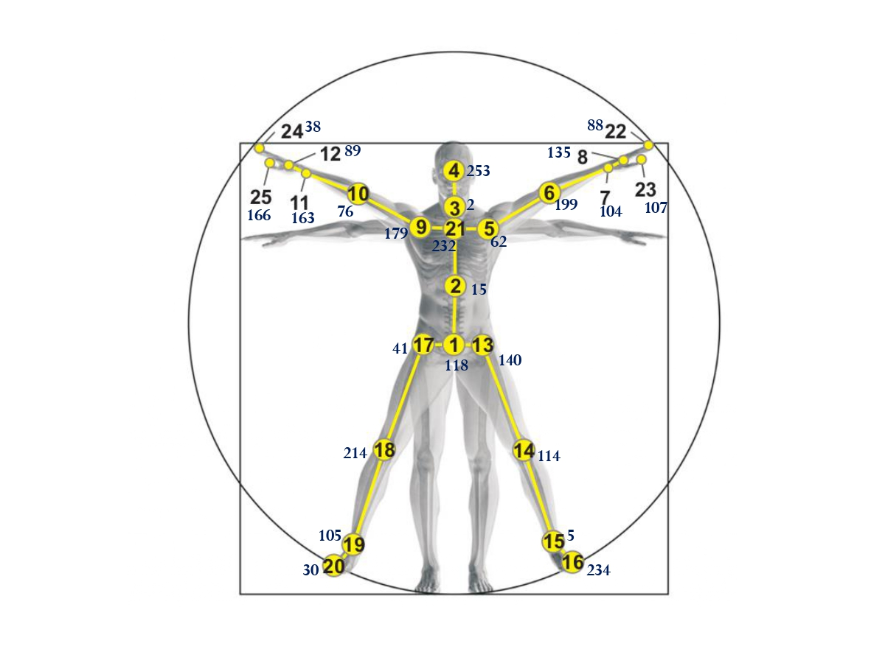

# NAPE: Numbering as A Position Encoding

This repository provides a reference implementation of *NAPE* as described in the [paper](https://ieeexplore.ieee.org/document/10750197).

We used NAPE to learn the position encoding for some benchmark datasets like WikiCS, PubMed and OGB-collab. This [links](https://github.com/olayinkaajayi/benchmarking-gnns-pos-encode.git) to the repository for all the experiments for each dataset.

The NAPE algorithm was used to learn the poistion encoding for the human skeletal graph (see figure below). The figure shows a human skeletal graph with the nodes numbered/ordered canonically from 1 to 25. And the figure also shows another numbering for each node using the NAPE algorithm. The NAPE ordering is used with the sinusoidal vector equation as position encodings for the skeletal graph in human action recognition models.

Here are the links to the implementation of some action recognition algorithms, with NAPE included as a position encoding for the human skeletal graph:
> [2s-AGCN](https://github.com/olayinkaajayi/2s-AGCN-NAPE.git) 
> [ST-GCN](https://github.com/olayinkaajayi/ActionRecognition.git) 
> [InfoGCN](https://github.com/olayinkaajayi/infogcn-wt-NAPE.git)

### Abstract
Deep learning has been instrumental in feature extraction from various data types, such as images and sequences, which inherently possess oriented structures. However, graph data, which delineate relationships between entities, lack such structures, posing challenges for embedding nodes uniquely in high-dimensional spaces. This paper introduces a novel position encoding method, Numbering as a Position Encoding (NAPE), which utilizes precomputed random walks and Hamming distances to approximate node orderings in graphs. NAPE assigns unique integers to nodes based on their local neighborhoods, facilitating the generation of sinusoidal vectors that uniquely encode node positions. This method mitigates the computational expenses and non-uniqueness issues associated with eigenvector-based approaches, ensuring distinct node embeddings for various graph-based applications, including human action recognition. Our approach, scalable with computational complexity $\mathcal{O}(|V|^2)$, demonstrates improved efficiency and effectiveness in embedding nodes uniquely. Notably, NAPE improves the accuracy of action recognition models applied to human skeletal graphs. The versatility of NAPE is highlighted by its ability to generalize across different models, making it a robust solution for training action recognition systems with large parameter sizes.

### Note
We have used as part of our implementation the repository of [Node2Vec](https://github.com/aditya-grover/node2vec.git), especially for scaling the NAPE algorithm.
